#  Utility App

My All-in-One Utility App offers a suite of tools for everyday needs: create avatars, convert currencies, track crypto, access a dictionary, translate languages, generate memes and QR codes, and more. Enhance productivity and fun with our comprehensive utilities!

## Screenshots

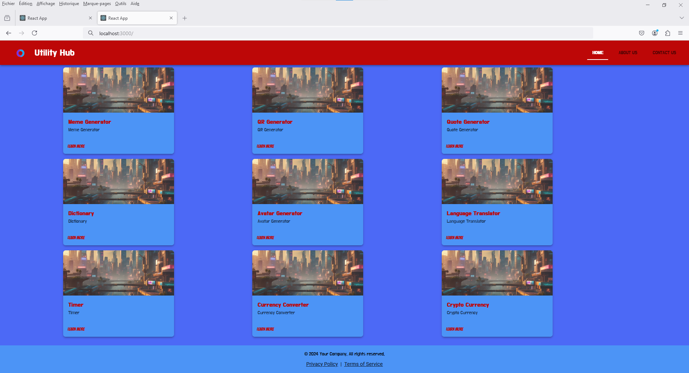
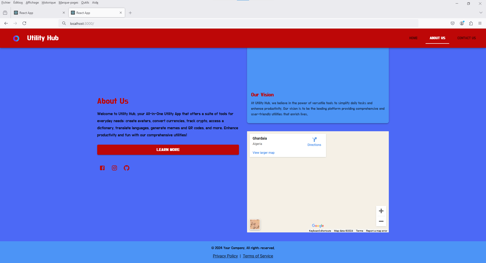
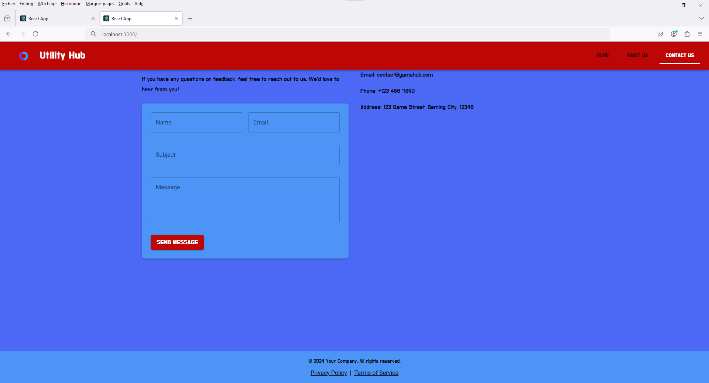
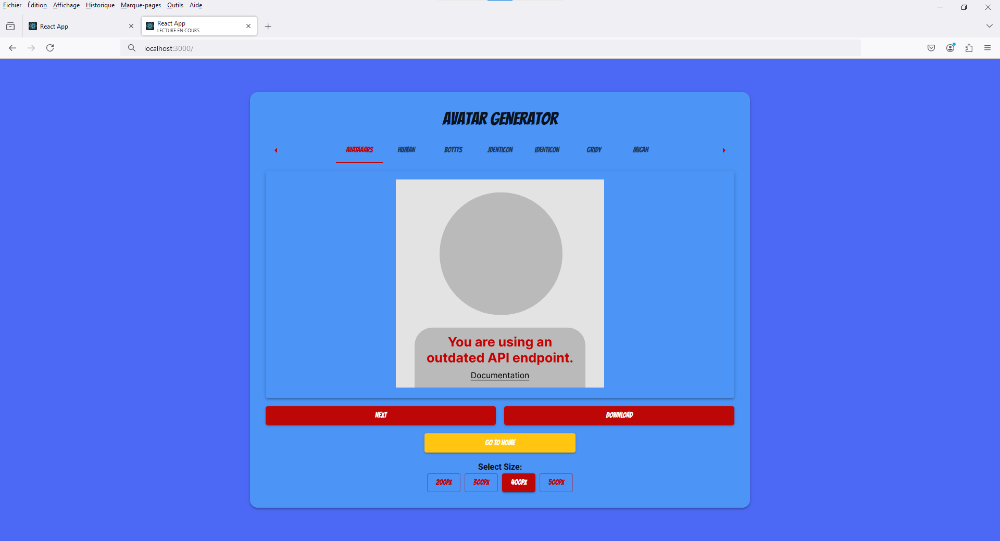
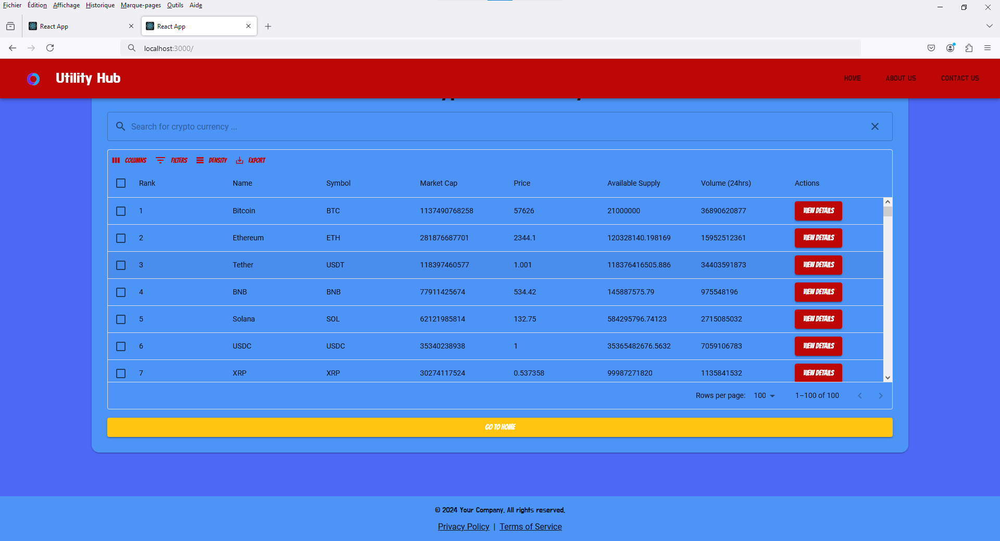

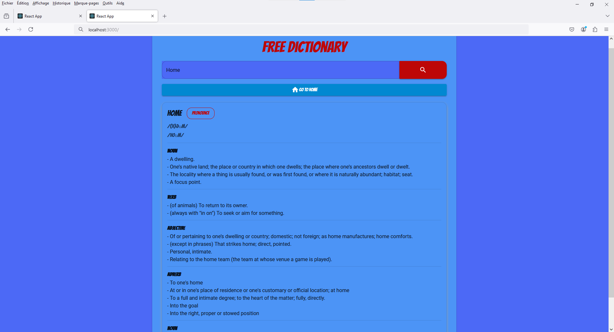
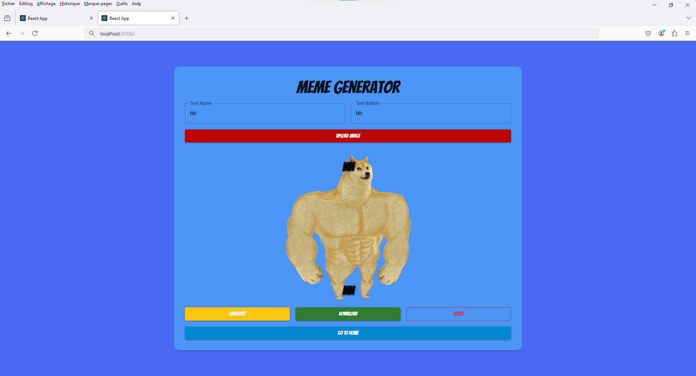
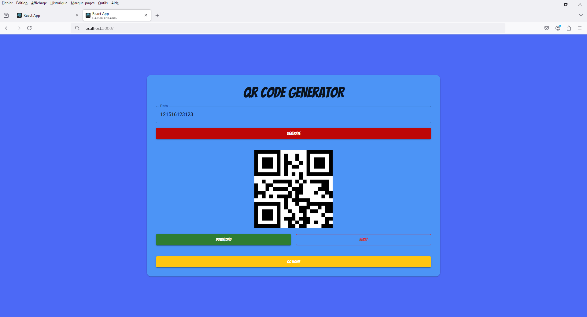
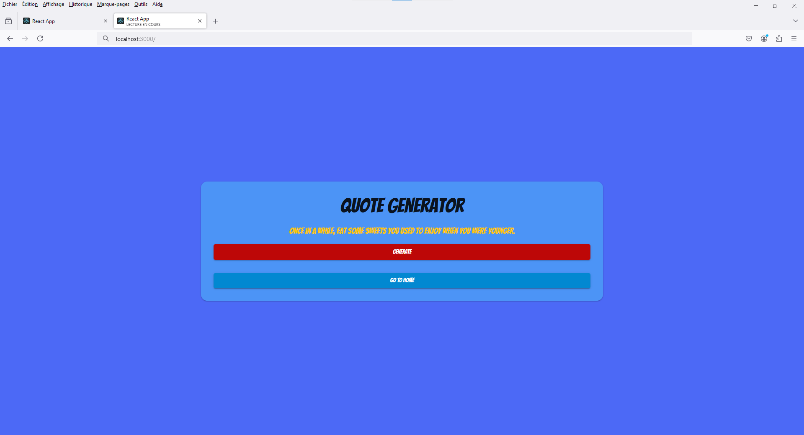
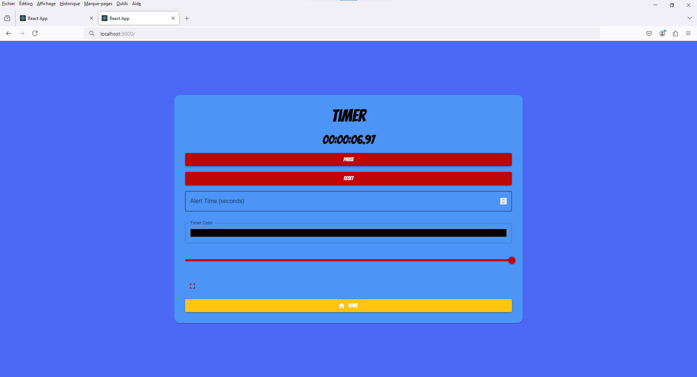
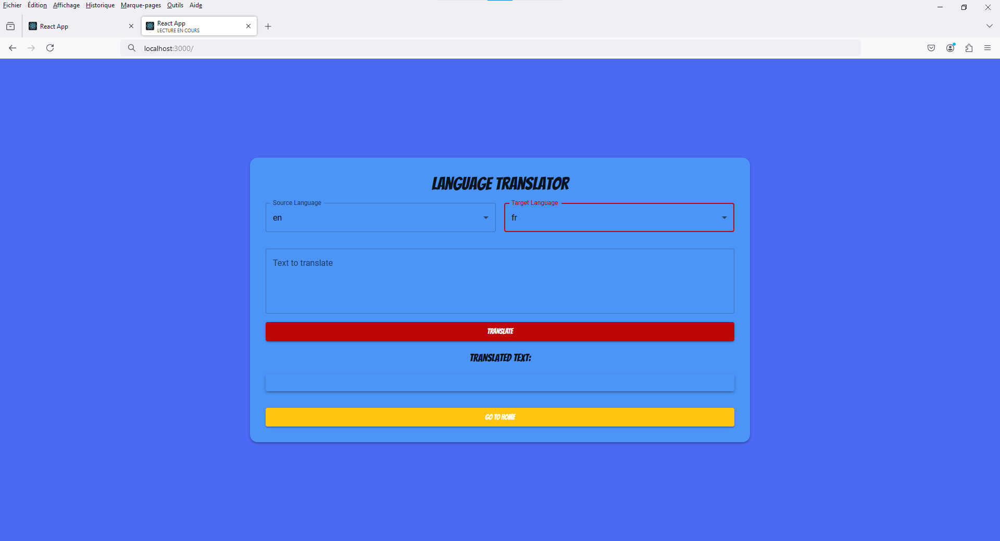

*Home screen showcasing all available utilities.*

  
*Creating a custom avatar using the Avatar Creator tool.*

## Features

- Create personalized avatars.
- Convert currencies with real-time exchange rates.
- Track cryptocurrency prices and trends.
- Access a dictionary for instant definitions.
- Translate text between multiple languages.
- Generate memes quickly and easily.
- Create QR codes for URLs, texts, and more.
- Regular updates with new utilities and features.

## Installation

To run this project locally, follow these steps:

1. Clone the repository:
    ```bash
    git clone https://github.com/username/utility-app.git
    cd utility-app
    ```

2. Install dependencies:
    ```bash
    npm install
    ```

3. Start the development server:
    ```bash
    npm start
    ```

Your app will be running at `http://localhost:3000`.

## Usage

Open the application and explore the different utilities from the main menu. Click on a tool to use it and follow the on-screen instructions.

## Contributing

Contributions are welcome! Please fork the repository and submit a pull request with your changes. Ensure your code follows the existing style and includes relevant tests.

## License

This project is licensed under the MIT License - see the [LICENSE](LICENSE) file for details.

## Contact

For any questions or feedback, feel free to reach out:
- Email: idriss.ziadi47@gmail.com
- GitHub: [idrissziadi](https://github.com/idrissziadi)

## Technologies Used

- React
- JavaScript (ES6+)
- HTML/CSS
- Material UI
